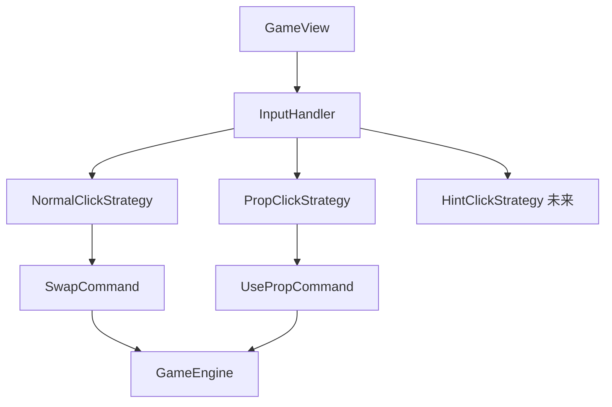

# 鼠标交互系统设计

> **目标**: 将GameView的鼠标交互逻辑解耦为独立组件，支持后续提示窗口功能
> **时间**: 2025-12-14
> **状态**: 设计中

---

## 📊 当前问题分析

### GameView中的鼠标交互代码
当前GameView.cpp包含约230行鼠标交互代码：
- `mousePressEvent()` - 鼠标按下事件（~30行）
- `mouseReleaseEvent()` - 鼠标释放事件（~5行）
- `mouseMoveEvent()` - 鼠标移动事件（~10行）
- `handleNormalClick()` - 普通交换模式处理（~35行）
- `handlePropClick()` - 道具模式处理（~45行）
- `releaseProp()` - 道具释放逻辑（~50行）
- `cancelProp()` - 道具取消逻辑（~15行）
- `drawPropSelection()` - 绘制道具选中框（~55行）
- `screenToGrid()` - 坐标转换（~10行）

**问题**:
1. 鼠标逻辑与渲染逻辑混在一起
2. 难以扩展（如添加提示窗口、多点触控）
3. 状态管理分散（选中状态、道具状态）
4. 无法独立测试

---

## 🎯 设计方案

### 核心思想：策略模式 + 命令模式



### 类设计

#### 1. InputHandler - 输入处理器（主控制器）

```cpp
/**
 * @brief 输入处理器 - 管理所有鼠标交互逻辑
 */
class InputHandler : public QObject
{
    Q_OBJECT
    
public:
    InputHandler(QObject* parent = nullptr);
    ~InputHandler() = default;
    
    // 设置游戏引擎
    void setGameEngine(GameEngine* engine);
    
    // 处理鼠标事件（由GameView调用）
    void handleMousePress(const QPoint& screenPos, const QRect& gridRect, float cellSize);
    void handleMouseRelease(const QPoint& screenPos);
    void handleMouseMove(const QPoint& screenPos, const QRect& gridRect, float cellSize);
    
    // 模式切换
    void setClickMode(ClickMode mode);
    ClickMode getClickMode() const { return currentMode_; }
    
    // 获取当前状态（用于渲染）
    const SelectionState& getSelectionState() const { return selectionState_; }
    const PropState& getPropState() const { return propState_; }
    
signals:
    // 信号：通知GameView执行操作
    void swapRequested(int row1, int col1, int row2, int col2);
    void propReleaseRequested(ClickMode propType, int row1, int col1, int row2 = -1, int col2 = -1);
    void selectionChanged();
    void propStateChanged();
    
private:
    // 坐标转换
    bool screenToGrid(const QPoint& screenPos, const QRect& gridRect, float cellSize, int& row, int& col);
    
    GameEngine* gameEngine_;
    ClickMode currentMode_;
    
    // 状态数据
    SelectionState selectionState_;  // 选中状态
    PropState propState_;             // 道具状态
    
    // 策略对象
    std::unique_ptr<IClickStrategy> clickStrategy_;
};
```

#### 2. 状态数据结构

```cpp
/**
 * @brief 选中状态
 */
struct SelectionState
{
    bool hasSelection = false;
    int selectedRow = -1;
    int selectedCol = -1;
    
    void clear() {
        hasSelection = false;
        selectedRow = -1;
        selectedCol = -1;
    }
    
    void select(int row, int col) {
        hasSelection = true;
        selectedRow = row;
        selectedCol = col;
    }
};

/**
 * @brief 道具交互状态
 */
enum class PropInteractionState {
    NONE,           // 无道具
    HOLDING,        // 持有道具，跟随鼠标
    FIRST_SELECTED, // 已选中第一个目标（仅夹子）
    READY           // 准备释放
};

struct PropState
{
    PropInteractionState state = PropInteractionState::NONE;
    ClickMode propType = ClickMode::NORMAL;
    int targetRow1 = -1;
    int targetCol1 = -1;
    int targetRow2 = -1;  // 仅夹子使用
    int targetCol2 = -1;
    
    void clear() {
        state = PropInteractionState::NONE;
        propType = ClickMode::NORMAL;
        targetRow1 = targetCol1 = -1;
        targetRow2 = targetCol2 = -1;
    }
    
    bool isActive() const {
        return state != PropInteractionState::NONE;
    }
};
```

#### 3. IClickStrategy - 点击策略接口

```cpp
/**
 * @brief 点击策略接口
 */
class IClickStrategy
{
public:
    virtual ~IClickStrategy() = default;
    
    /**
     * @brief 处理点击
     * @return 是否产生了操作（需要通知GameView）
     */
    virtual bool handleClick(int row, int col, SelectionState& selection, PropState& propState) = 0;
};
```

#### 4. NormalClickStrategy - 普通交换策略

```cpp
/**
 * @brief 普通交换模式策略
 */
class NormalClickStrategy : public IClickStrategy
{
public:
    bool handleClick(int row, int col, SelectionState& selection, PropState& propState) override;
    
    // 信号回调
    std::function<void(int, int, int, int)> onSwapRequested;
};
```

#### 5. PropClickStrategy - 道具点击策略

```cpp
/**
 * @brief 道具模式策略
 */
class PropClickStrategy : public IClickStrategy
{
public:
    bool handleClick(int row, int col, SelectionState& selection, PropState& propState) override;
    
    // 信号回调
    std::function<void(ClickMode, int, int, int, int)> onPropReleaseRequested;
};
```

---

## 📝 详细实现

### InputHandler.h

```cpp
#ifndef INPUTHANDLER_H
#define INPUTHANDLER_H

#include <QObject>
#include <QPoint>
#include <QRect>
#include <memory>
#include <functional>
#include "GameEngine.h"

// 选中状态
struct SelectionState
{
    bool hasSelection = false;
    int selectedRow = -1;
    int selectedCol = -1;
    
    void clear();
    void select(int row, int col);
};

// 道具交互状态
enum class PropInteractionState {
    NONE,           // 无道具
    HOLDING,        // 持有道具，跟随鼠标
    FIRST_SELECTED, // 已选中第一个目标（仅夹子）
    READY           // 准备释放
};

struct PropState
{
    PropInteractionState state = PropInteractionState::NONE;
    ClickMode propType = ClickMode::NORMAL;
    int targetRow1 = -1;
    int targetCol1 = -1;
    int targetRow2 = -1;  // 仅夹子使用
    int targetCol2 = -1;
    
    void clear();
    bool isActive() const;
};

// 前向声明
class IClickStrategy;

/**
 * @brief 输入处理器 - 管理所有鼠标交互逻辑
 */
class InputHandler : public QObject
{
    Q_OBJECT
    
public:
    explicit InputHandler(QObject* parent = nullptr);
    ~InputHandler() override;
    
    // 设置游戏引擎
    void setGameEngine(GameEngine* engine);
    
    // 处理鼠标事件（由GameView调用）
    void handleMousePress(const QPoint& screenPos, const QRect& gridRect, float cellSize);
    void handleMouseRelease(const QPoint& screenPos);
    void handleMouseMove(const QPoint& screenPos, const QRect& gridRect, float cellSize);
    
    // 模式切换
    void setClickMode(ClickMode mode);
    ClickMode getClickMode() const { return currentMode_; }
    
    // 获取当前状态（用于渲染）
    const SelectionState& getSelectionState() const { return selectionState_; }
    const PropState& getPropState() const { return propState_; }
    
    // 检查是否可以接受输入（非动画状态）
    void setCanAcceptInput(bool canAccept) { canAcceptInput_ = canAccept; }
    
signals:
    // 信号：通知GameView执行操作
    void swapRequested(int row1, int col1, int row2, int col2);
    void propReleaseRequested(ClickMode propType, int row1, int col1, int row2, int col2);
    void selectionChanged();
    void propStateChanged();
    void requestMouseTracking(bool enable);  // 请求启用/禁用鼠标跟踪
    
private:
    // 坐标转换
    bool screenToGrid(const QPoint& screenPos, const QRect& gridRect, float cellSize, int& row, int& col);
    
    // 切换点击策略
    void updateClickStrategy();
    
    GameEngine* gameEngine_;
    ClickMode currentMode_;
    bool canAcceptInput_;
    
    // 状态数据
    SelectionState selectionState_;
    PropState propState_;
    
    // 策略对象
    std::unique_ptr<IClickStrategy> clickStrategy_;
};

#endif // INPUTHANDLER_H
```

### InputHandler.cpp

```cpp
#include "InputHandler.h"
#include "NormalClickStrategy.h"
#include "PropClickStrategy.h"

// ========== SelectionState 实现 ==========

void SelectionState::clear()
{
    hasSelection = false;
    selectedRow = -1;
    selectedCol = -1;
}

void SelectionState::select(int row, int col)
{
    hasSelection = true;
    selectedRow = row;
    selectedCol = col;
}

// ========== PropState 实现 ==========

void PropState::clear()
{
    state = PropInteractionState::NONE;
    propType = ClickMode::NORMAL;
    targetRow1 = targetCol1 = -1;
    targetRow2 = targetCol2 = -1;
}

bool PropState::isActive() const
{
    return state != PropInteractionState::NONE;
}

// ========== InputHandler 实现 ==========

InputHandler::InputHandler(QObject* parent)
    : QObject(parent)
    , gameEngine_(nullptr)
    , currentMode_(ClickMode::NORMAL)
    , canAcceptInput_(true)
{
    updateClickStrategy();
}

InputHandler::~InputHandler() = default;

void InputHandler::setGameEngine(GameEngine* engine)
{
    gameEngine_ = engine;
}

void InputHandler::setClickMode(ClickMode mode)
{
    // 如果有活跃的道具状态，先清除
    if (propState_.isActive()) {
        propState_.clear();
        emit propStateChanged();
    }
    
    currentMode_ = mode;
    
    // 更新策略
    updateClickStrategy();
    
    // 如果是道具模式，设置道具状态
    if (mode == ClickMode::PROP_HAMMER || 
        mode == ClickMode::PROP_CLAMP || 
        mode == ClickMode::PROP_MAGIC_WAND) {
        propState_.state = PropInteractionState::HOLDING;
        propState_.propType = mode;
        emit requestMouseTracking(true);  // 开启鼠标跟踪
        emit propStateChanged();
    } else {
        emit requestMouseTracking(false);
    }
    
    // 清除选中状态
    selectionState_.clear();
    emit selectionChanged();
}

void InputHandler::handleMousePress(const QPoint& screenPos, const QRect& gridRect, float cellSize)
{
    if (!canAcceptInput_) {
        return;  // 动画期间不接受输入
    }
    
    int row, col;
    if (screenToGrid(screenPos, gridRect, cellSize, row, col)) {
        // 点击在网格内，使用策略处理
        if (clickStrategy_) {
            bool changed = clickStrategy_->handleClick(row, col, selectionState_, propState_);
            if (changed) {
                emit selectionChanged();
                emit propStateChanged();
            }
        }
    } else {
        // 点击网格外，取消选中或道具
        if (propState_.isActive()) {
            propState_.clear();
            emit propStateChanged();
        } else if (selectionState_.hasSelection) {
            selectionState_.clear();
            emit selectionChanged();
        }
    }
}

void InputHandler::handleMouseRelease(const QPoint& screenPos)
{
    Q_UNUSED(screenPos);
    // 可以在这里处理拖拽结束等逻辑
}

void InputHandler::handleMouseMove(const QPoint& screenPos, const QRect& gridRect, float cellSize)
{
    Q_UNUSED(screenPos);
    Q_UNUSED(gridRect);
    Q_UNUSED(cellSize);
    
    // 道具持有状态时，触发重绘以显示跟随效果
    if (propState_.state == PropInteractionState::HOLDING) {
        emit propStateChanged();
    }
}

bool InputHandler::screenToGrid(const QPoint& screenPos, const QRect& gridRect, float cellSize, int& row, int& col)
{
    float gridX = screenPos.x() - gridRect.x();
    float gridY = screenPos.y() - gridRect.y();
    
    col = static_cast<int>(gridX / cellSize);
    row = static_cast<int>(gridY / cellSize);
    
    return (row >= 0 && row < MAP_SIZE && col >= 0 && col < MAP_SIZE);
}

void InputHandler::updateClickStrategy()
{
    if (currentMode_ == ClickMode::NORMAL) {
        // 普通交换模式
        auto strategy = std::make_unique<NormalClickStrategy>();
        
        // 设置回调
        strategy->onSwapRequested = [this](int r1, int c1, int r2, int c2) {
            emit swapRequested(r1, c1, r2, c2);
        };
        
        clickStrategy_ = std::move(strategy);
    } else {
        // 道具模式
        auto strategy = std::make_unique<PropClickStrategy>();
        
        // 设置回调
        strategy->onPropReleaseRequested = [this](ClickMode type, int r1, int c1, int r2, int c2) {
            emit propReleaseRequested(type, r1, c1, r2, c2);
        };
        
        clickStrategy_ = std::move(strategy);
    }
}
```

### NormalClickStrategy.h/cpp

```cpp
// NormalClickStrategy.h
#ifndef NORMALCLICKSTRATEGY_H
#define NORMALCLICKSTRATEGY_H

#include "IClickStrategy.h"
#include <functional>

class NormalClickStrategy : public IClickStrategy
{
public:
    bool handleClick(int row, int col, SelectionState& selection, PropState& propState) override;
    
    std::function<void(int, int, int, int)> onSwapRequested;
};

#endif

// NormalClickStrategy.cpp
#include "NormalClickStrategy.h"
#include <cmath>

bool NormalClickStrategy::handleClick(int row, int col, SelectionState& selection, PropState& propState)
{
    Q_UNUSED(propState);
    
    if (!selection.hasSelection) {
        // 第一次点击，选中水果
        selection.select(row, col);
        return true;
    } else {
        // 第二次点击
        if (row == selection.selectedRow && col == selection.selectedCol) {
            // 点击同一个，取消选中
            selection.clear();
            return true;
        } else if (std::abs(row - selection.selectedRow) + std::abs(col - selection.selectedCol) == 1) {
            // 相邻元素，触发交换
            if (onSwapRequested) {
                onSwapRequested(selection.selectedRow, selection.selectedCol, row, col);
            }
            selection.clear();
            return true;
        } else {
            // 不相邻，切换选中目标
            selection.select(row, col);
            return true;
        }
    }
}
```

### PropClickStrategy.h/cpp

```cpp
// PropClickStrategy.h
#ifndef PROPCLICKSTRATEGY_H
#define PROPCLICKSTRATEGY_H

#include "IClickStrategy.h"
#include <functional>

class PropClickStrategy : public IClickStrategy
{
public:
    bool handleClick(int row, int col, SelectionState& selection, PropState& propState) override;
    
    std::function<void(ClickMode, int, int, int, int)> onPropReleaseRequested;
};

#endif

// PropClickStrategy.cpp
#include "PropClickStrategy.h"

bool PropClickStrategy::handleClick(int row, int col, SelectionState& selection, PropState& propState)
{
    Q_UNUSED(selection);
    
    switch (propState.state) {
        case PropInteractionState::HOLDING:
            // 持有道具状态，第一次点击：选中目标
            if (propState.propType == ClickMode::PROP_CLAMP) {
                // 夹子需要选中第一个目标
                propState.targetRow1 = row;
                propState.targetCol1 = col;
                propState.state = PropInteractionState::FIRST_SELECTED;
            } else {
                // 锤子和魔法棒只需要一个目标
                propState.targetRow1 = row;
                propState.targetCol1 = col;
                propState.state = PropInteractionState::READY;
                // 立即释放
                if (onPropReleaseRequested) {
                    onPropReleaseRequested(propState.propType, row, col, -1, -1);
                }
            }
            return true;
            
        case PropInteractionState::FIRST_SELECTED:
            // 已选中第一个目标（仅夹子），第二次点击：选中第二个目标
            if (row == propState.targetRow1 && col == propState.targetCol1) {
                // 点击同一个位置，取消选中
                propState.state = PropInteractionState::HOLDING;
                propState.targetRow1 = propState.targetCol1 = -1;
            } else {
                // 选中第二个目标
                propState.targetRow2 = row;
                propState.targetCol2 = col;
                propState.state = PropInteractionState::READY;
                // 立即释放
                if (onPropReleaseRequested) {
                    onPropReleaseRequested(
                        propState.propType,
                        propState.targetRow1, propState.targetCol1,
                        row, col
                    );
                }
            }
            return true;
            
        default:
            break;
    }
    
    return false;
}
```

---

## 🔄 GameView 集成方式

### 更新 GameView.h

```cpp
#include "InputHandler.h"

class GameView : public QOpenGLWidget, protected QOpenGLFunctions
{
    Q_OBJECT
    
public:
    
protected:
    void mousePressEvent(QMouseEvent *event) override;
    void mouseReleaseEvent(QMouseEvent *event) override;
    void mouseMoveEvent(QMouseEvent *event) override;
    
private slots:
    // 处理InputHandler的信号
    void onSwapRequested(int row1, int col1, int row2, int col2);
    void onPropReleaseRequested(ClickMode propType, int row1, int col1, int row2, int col2);
    void onSelectionChanged();
    void onPropStateChanged();
    void onRequestMouseTracking(bool enable);
    
private:
    // ========== 输入处理器 ==========
    std::unique_ptr<InputHandler> inputHandler_;
    
    // 删除旧的成员变量：
    // int selectedRow_;
    // int selectedCol_;
    // bool hasSelection_;
    // PropState propState_;
    // ... 其他道具相关状态
};
```

### 更新 GameView.cpp

```cpp
GameView::GameView(QWidget *parent)
    : QOpenGLWidget(parent)
    , inputHandler_(std::make_unique<InputHandler>(this))
    // ... 其他初始化
{
    // 连接信号
    connect(inputHandler_.get(), &InputHandler::swapRequested,
            this, &GameView::onSwapRequested);
    connect(inputHandler_.get(), &InputHandler::propReleaseRequested,
            this, &GameView::onPropReleaseRequested);
    connect(inputHandler_.get(), &InputHandler::selectionChanged,
            this, &GameView::onSelectionChanged);
    connect(inputHandler_.get(), &InputHandler::propStateChanged,
            this, &GameView::onPropStateChanged);
    connect(inputHandler_.get(), &InputHandler::requestMouseTracking,
            this, &GameView::onRequestMouseTracking);
}

void GameView::setGameEngine(GameEngine* engine)
{
    gameEngine_ = engine;
    inputHandler_->setGameEngine(engine);
}

void GameView::setClickMode(ClickMode mode)
{
    inputHandler_->setClickMode(mode);
}

void GameView::mousePressEvent(QMouseEvent *event)
{
    QRect gridRect(gridStartX_, gridStartY_, 
                   cellSize_ * MAP_SIZE, cellSize_ * MAP_SIZE);
    inputHandler_->handleMousePress(event->pos(), gridRect, cellSize_);
}

void GameView::mouseReleaseEvent(QMouseEvent *event)
{
    inputHandler_->handleMouseRelease(event->pos());
}

void GameView::mouseMoveEvent(QMouseEvent *event)
{
    QRect gridRect(gridStartX_, gridStartY_, 
                   cellSize_ * MAP_SIZE, cellSize_ * MAP_SIZE);
    inputHandler_->handleMouseMove(event->pos(), gridRect, cellSize_);
}

void GameView::onSwapRequested(int row1, int col1, int row2, int col2)
{
    // 保存快照
    snapshotManager_->saveSnapshot(gameEngine_->getMap());
    
    // 执行交换
    bool success = gameEngine_->swapFruits(row1, col1, row2, col2);
    
    // 开始动画
    animController_->beginSwap(success);
}

void GameView::onPropReleaseRequested(ClickMode propType, int row1, int col1, int row2, int col2)
{
    // 保存快照
    snapshotManager_->saveSnapshot(gameEngine_->getMap());
    
    bool success = false;
    
    if (propType == ClickMode::PROP_CLAMP) {
        success = gameEngine_->useClampProp(row1, col1, row2, col2);
        if (success) {
            animController_->beginSwap(true);
        }
    } else {
        success = gameEngine_->useProp(propType, row1, col1);
        if (success) {
            const auto& animSeq = gameEngine_->getLastAnimation();
            if (!animSeq.rounds.empty()) {
                animController_->beginElimination(0);
            }
        }
    }
}

void GameView::onSelectionChanged()
{
    update();  // 触发重绘
}

void GameView::onPropStateChanged()
{
    update();  // 触发重绘
}

void GameView::onRequestMouseTracking(bool enable)
{
    setMouseTracking(enable);
}

// 绘制选中框（使用InputHandler的状态）
void GameView::drawSelection()
{
    const auto& selection = inputHandler_->getSelectionState();
    if (!selection.hasSelection) return;
    
    float x = gridStartX_ + selection.selectedCol * cellSize_;
    float y = gridStartY_ + selection.selectedRow * cellSize_;
    
    // ... 绘制逻辑
}

// 绘制道具选中框
void GameView::drawPropSelection()
{
    const auto& propState = inputHandler_->getPropState();
    if (!propState.isActive()) return;
    
    // ... 绘制逻辑
}
```

---

## 📈 收益分析

| 指标 | 重构前 | 重构后 | 改进 |
|-----|-------|-------|------|
| GameView鼠标代码 | ~230行 | ~80行 | ⬇️ -65% |
| 职责分离 | ❌ 混合 | ✅ 清晰 | ⬆️ 明显提升 |
| 可测试性 | ❌ 难测试 | ✅ 易测试 | ⬆️ 明显提升 |
| 可扩展性 | ❌ 难扩展 | ✅ 易扩展 | ⬆️ 支持提示窗口 |

---

## 🚀 后续扩展：提示窗口支持

当需要添加提示窗口时，只需：

```cpp
// 1. 创建 HintClickStrategy
class HintClickStrategy : public IClickStrategy
{
public:
    bool handleClick(int row, int col, SelectionState& selection, PropState& propState) override {
        // 显示该位置的提示信息
        emit showHintWindow(row, col);
        return true;
    }
    
    std::function<void(int, int)> onShowHintWindow;
};

// 2. 在 InputHandler 中添加提示模式
void InputHandler::setClickMode(ClickMode mode)
{
    if (mode == ClickMode::HINT) {
        auto strategy = std::make_unique<HintClickStrategy>();
        strategy->onShowHintWindow = [this](int row, int col) {
            emit hintWindowRequested(row, col);
        };
        clickStrategy_ = std::move(strategy);
    }
    // ... 其他模式
}
```

完全不需要修改GameView的核心逻辑！

---

**设计完成，准备实现！**
